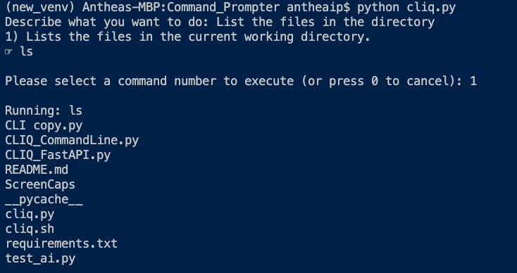

# Command Line Helper (CLIQ)

### Overview

CLIQ is a command line helper application designed to assist users in generating shell commands based on natural language queries. It uses a Large Language Model (LLM) to provide up to three command suggestions that match the user's request. The application can be run locally using Ollama 3.2 or remotely using OpenAI's GPT-4.0 model.

This app supports two modes of usage:

- Local: Utilizing Ollama 3.2, which can be downloaded and set up locally.

- Remote: Using OpenAI's GPT-4.0 model via an API endpoint.

### Features

- Generate shell commands based on a natural language query.

- Run the app locally or remotely.

- Option to either pass the command query as a command line argument or input it interactively.

- Safe, non-destructive commands only, to prevent accidental damage to your system.

### Prerequisites

1. Python: Python 3.7 or later.

2. Ollama: Install Ollama 3.2 if running locally.

3. OpenAI API: An OpenAI API key, if you wish to use GPT-4.0 remotely.

4. Dependencies: Listed in requirements.txt. Install via pip (see instructions below).

### Installation

1. Clone the Repository:

    `git clone <repo_url>`  
    `cd <repo_name>`

2. Create and Activate a Virtual Environment
- Create a virtual environment named `venv`:  
    `python -m venv venv`
- Activate the virtual environment:
  - Linux / macOS
  - `source venv/bin/activate`
  - Windows
  - `.\venv\Scripts\activate`

3. Install Dependencies:  
    `pip install -r requirements.txt`

4. Set Up Environment Variables:

- Create a .env file in the root directory with the following content:

    `GITHUB_TOKEN=<your_openai_api_key>`

- Replace <your_openai_api_key> with your OpenAI API key.

### Usage

The application can be run in two modes: **local** or **remote**.

##### Running the App

1. Local Mode (using Ollama 3.2):

- This will use the locally installed model (Ollama 3.2). 
     `python3 CLIQ_CommandLine.py "list the files in the directory"`
    
 

2. Remote Mode (using OpenAI GPT-4.0): 
    `python3 CLIQ_CommandLine.py -r "list the files in the directory"`

   - The -r flag specifies that the app should use the OpenAI remote model.

3. Interactive Mode:

- Run the app without any arguments:

    `python3 CLIQ_CommandLine.py`

- You will then be prompted to enter your query interactively:

    `Describe what you want to do:`  
        
 

##### Example Queries

- "list all files in the current directory"

- "find all Python files in subdirectories"

##### Command Execution

- The app provides up to three command suggestions based on your query.

- After viewing the suggestions, you can select a command to run by entering its number.

- If the selected command is invalid or potentially dangerous, the app will alert you.

### Notes

- Ensure Ollama 3.2 is properly set up if you plan to run locally.

- The commands generated are intended to be non-destructive and safe for typical Unix-like environments.

### Dependencies

- Python Libraries: Listed in requirements.txt
  
  - subprocess, argparse, shutil, dotenv, openai, etc.

### Contributing

Contributions are welcome! Feel free to create issues or submit pull requests.

### License

This project is licensed under the MIT License. See the LICENSE file for more details.
