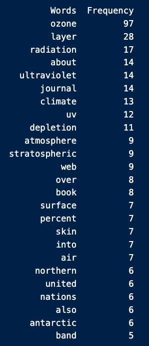
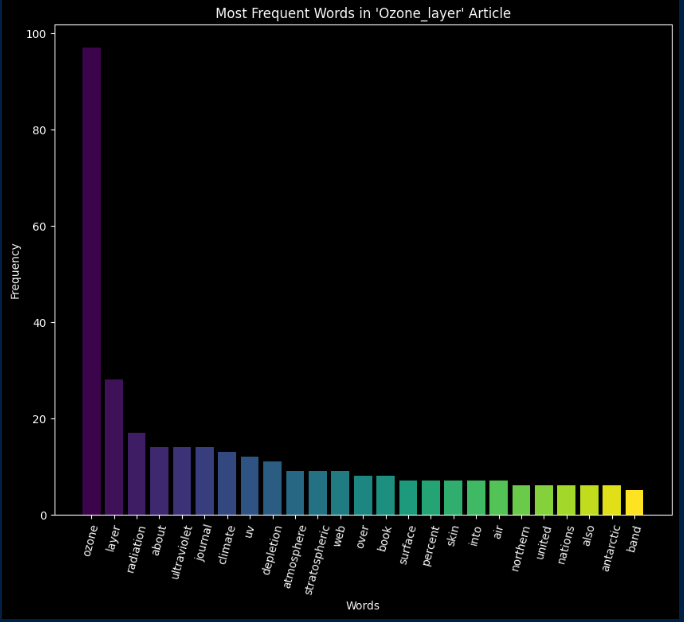

# My Mr Clean
## DESCRIPTION
 My Mr. Clean is a python utility for extracting information via API, determining the most common words, and plotting their frequencies

## DEPENDENCIES
Python 3.6 or higher

## INSTALLATION
Clone this repository to your local machine
Ensure Python is installed on your system
- python3 --version
  
Install Jupyter and the requirements
- pip install jupyterlab
- pip install -r requirements.txt

## EXECUTE PROGRAM
1. Navigate to the directory containing my_mr_clean.ipynb
2. Start Jupyter Notbook or Jupyter Lab:
   1. For Notebook: 'jupyter notebook'
   2. For Lab: 'jupyter lab'
3. In the Jupyter interface, navigate to 'my_mr_clean.ipynb'
4. Click on the arrow to run the notebook cells, 
   1. Or use "Cell" > "Run All"

## THE CODE / OUTPUT
The code access the article "Ozone_layer" from Wikipedia

#### get_content
This method makes an HTTP GET request to the Wikipedia API and returns a JSON response of the content in the page

#### merge_contents
This method cleans the data by merging the contents from the page into a single string; it extracts the pages from the data in get_content, and concatenates the content, returning the merged content.

#### tokenize
This method splits the merged contents into words split by spaces and newline characters. It returns a list of tokens/words.

#### lower_collection
This method converts all of the tokenized content (words) to lower case.

#### count_frequency
This method counts and returns the frequency of each word in the collection of lower_case words.

#### remove_stop_words
This method removes insignificant words (e.g the, a, an, in, etc.) from the collection of lower_case words.

#### get_most_frequent
This method gets the most frequent words (without stop_words).

#### Table
Created a DataFrame of Words and Frequency

#### PLOTTING
- Dark background
- Figure size 10" wide, 8" tall
- "Words" on the x-axis, "Frequency" on y-axis
- Title of article at top
- Rotation of x-axis values rotated 75 deg.
- I imported numpy and matplotlib cm for color mapping. This allowed me to create a different color for each word's frequency.

#### THE TABLE  

#### THE PLOT   

