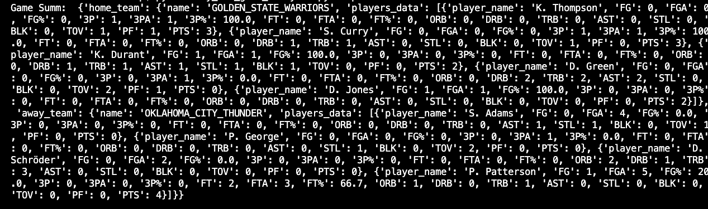
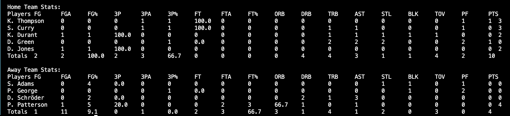
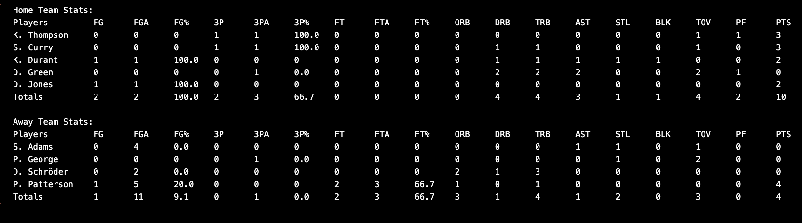

# Welcome to My Nba Game Analysis
Given an NBA game's statistics, my mission was to calculate and display the statistics per player on the home and away teams.

## Task
I was given sample NBA game .txt files that included an array of play data. My code summarizes each player's:
Field Goals
Filed Goal Attempts
Field Goal %
3-Pointers
3-Point Attempts
3-Point %
Free Throws
Free Throw Attempts
Free Throw %
Offensive Rebounds
Defensive Rebounds
Total Rebounds
Assists
Steals
Blocks
Turnovers
Personal Fouls
Points

The printing function prints the output in tablular format (although the spacing is wonky).

## Description
Each play is the following format: 
PERIOD|REMAINING_SEC|RELEVANT_TEAM|AWAY_TEAM|HOME_TEAM|AWAY_SCORE|HOME_SCORE|DESCRIPTION

The output is in this format: 
{"home_team": {"name": TEAM_NAME, "players_data": DATA}, "away_team": {"name": TEAM_NAME, "players_data": DATA}}
DATA will be an array of hashes with this format:
{"player_name": XXX, "FG": XXX, "FGA": XXX, "FG%": XXX, "3P": XXX, "3PA": XXX, "3P%": XXX, "FT": XXX, "FTA": XXX, "FT%": XXX, "ORB": XXX, "DRB": XXX, "TRB": XXX, "AST": XXX, "STL": XXX, "BLK": XXX, "TOV": XXX, "PF": XXX, "PTS": XXX}

And the table is in this format: 
Players	    FG	FGA	FG%	    3P	3PA	3P%	    FT	FTA	FT%	    ORB	DRB	TRB	AST	STL	BLK	TOV	PF	PTS
Player00	XX	XX	.XXX	X	XX	.XXX	XX	XX	.XXX	XX	XX	XX	XX	X	X	XX	XX	XX
Totals	    XX	XX	.XXX	X	XX	.XXX	XX	XX	.XXX	XX	XX	XX	XX	X	X	XX	XX	XX

The challenge was to find a way to search for terms that would reliably find the statistics, yet allow for inconsistencies in how the statistics are recorded. For example, both of these plays are Turnovers, but the first also includes a steal.

1|458.0|GOLDEN_STATE_WARRIORS|OKLAHOMA_CITY_THUNDER|GOLDEN_STATE_WARRIORS|8|14|Turnover by D. Green (bad pass; steal by P. Patterson)
1|435.0|OKLAHOMA_CITY_THUNDER|OKLAHOMA_CITY_THUNDER|GOLDEN_STATE_WARRIORS|8|16|Turnover by D. Schröder (bad pass)

I achieved this by first having an updates_stats method that would search the play's description for "make" using regular expressions (regex) when there is one event in the description, and also an update method to find the second event (e.g. steal.)

Some of the statistics collection is tricky. In the example below, the home team has ball possession. However I'm collecting the foul data. In this case, the code finds "foul by" and then swaps the team (i.e. Oklahoma City) to update the player's foul statistic.
1|401.0|GOLDEN_STATE_WARRIORS|OKLAHOMA_CITY_THUNDER|GOLDEN_STATE_WARRIORS|11|16|Personal foul by T. Ferguson (drawn by K. Durant)

The code outputs the data summary array, plus the summaries in table format.

### The code functions:
load_data 
* Initializes Result List
* Opens CSV file
* Reads rows
* Returns result

is_away_team 
* Checks if the current team is the away team

update_stats 
* Checks for Scoring Plays and Events (missed shots, fouls, rebounds, etc.)

calculate_percentages 
* Calculates the percentages for field goals, 3-points, free throws

initialize_player_stats 
* Initializes a player's stats (when they are not in the results yet)

analyse_nba_game 
* Initializes result dictionary
* Define Regex Patterns ("patterns")
* Iterates over each play, 
* Determines and updates the team name
* Determines team_key (team the player's stats will be assigned to)
* Updates Turnovers and Steals
* Determines player
* Updates fouls, assists, blocks (these plays will be combined with another play found in the update_stats)

print_nba_game_stats 
* First prints a header
* For each player in the data, iterates over the player statistics and prints them
* Keeps a total_stats for each event, and then prints the totals

_main 
* Parses the command line arguments
* Loads the data
* Analyzes the game
* Prints the array summary
* Prints Home Team Stats in tabular format
* Prints Away Team Stats in tablular format

## Installation
* Install Python 3 to your system
* The Data .txt file in the same directory as my_nba_game_analysis.py
* In the command line, type: python3 my_nba_game_analysis.py data.txt

For example, my data file is nba_game_warriors_thunder.txt: 
python3 my_nba_game_analysis.py nba_game_warriors_thunder.txt

## Usage
The code will analyze a game of basketball's play-by-play data.
It will print the summary array, then print in table format.

#### Command Line:  
* Command line command to run code using data file 'sample.txt'

#### Game Summary Array:  
* It's not very useful and readable; you can see why the tabular data is much more useful.

#### Summary Tables Output (unedited):  
* Data as output

#### Summary Tables Output (formatted):  
* I pasted the data into a text file and edited it to confirm the output is correct.

### The Core Team
Anthea Ip