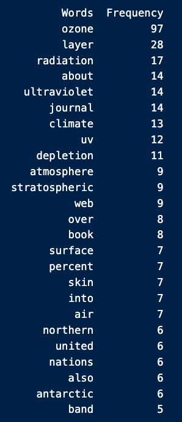
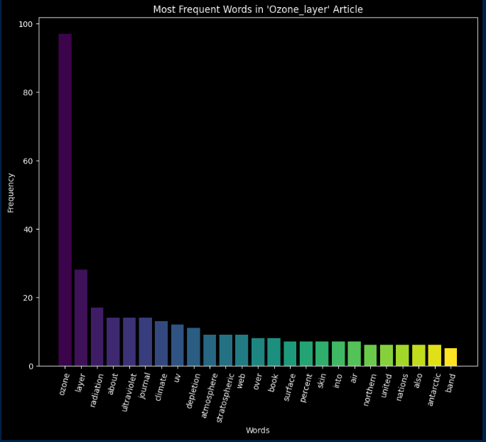

# My Mr Clean
## DESCRIPTION
This is a Python-based data pipeline to extract, clean, and analyze unstructured text data via API, applying techniques similar to financial data engineering workflows. It uses Pandas and Matplotlib for visualization, demonstrating skills in data preprocessing and trend analysis applicable to quantitative finance.
 

## DEPENDENCIES
Python 3.6 or higher
Jupyter

## INSTALLATION
Clone this repository to your local machine
Verify Python is installed on your system
- python3 --version
- If Python3 not installed, 
  - Visit Python.org and download the installer
  - Open the downloaded .pkg and follow the instructions
Run in a Virtual Environment
- Navigate to project directory i the Terminal
- run python3 -m venv myvenv(replace myvenv with desired environment name)
- Activate venv
  - macOS: source myvenv/bin/activate
  - Windows: myvenv\Scripts\activate
- Deactivate the venv later
  - deactivate
  
Install Jupyter and the requirements (which contains necessary Python packages)
- pip install jupyterlab
- pip install -r requirements.txt

## EXECUTE PROGRAM
1. Navigate to the directory containing my_mr_clean.ipynb
2. Start Jupyter Notebook or Jupyter Lab:
   1. For Notebook: 'jupyter notebook'
   2. For Lab: 'jupyter lab'
3. In the Jupyter interface, navigate to 'my_mr_clean.ipynb'
4. Click on the arrow to run the notebook cells, 
   1. Or use "Cell" > "Run All"

## THE CODE / OUTPUT
The code access the article "Ozone_layer" from Wikipedia

#### get_content
This method makes an HTTP GET request to the Wikipedia API and returns a JSON response of the content in the page.
URL: https://en.wikipedia.org/w/api.php
Article: Ozone_layer (https://en.wikipedia.org/wiki/Ozone_layer)

#### merge_contents
This method cleans the data by merging the textual content retrieved from multiple sections of the Wiki page into a single string; it extracts the pages from the data in get_content, and concatenates the content, returning the merged content.

#### tokenize
This method splits the merged contents into words split by spaces and newline characters. It returns a list of tokens/words.

#### lower_collection
This method converts all of the tokenized content (words) to lower case.

#### count_frequency
This method counts and returns the frequency of each word in the collection of lower_case words.

#### remove_stop_words
This method removes insignificant words (e.g the, a, an, in, etc.) from the collection of lower_case words.

#### get_most_frequent
This method gets the most frequent words (without stop_words).

#### Table
Created a DataFrame of Words and Frequency using Pandas

#### PLOTTING
- Uses matplotlib
- Dark background
- Figure size 10" wide, 8" tall
- "Words" on the x-axis, "Frequency" on y-axis
- Title of article at top
- Rotation of x-axis values rotated 75 deg.
- I imported numpy and matplotlib cm for color mapping. This allowed me to create a different color for each word's frequency.

#### THE TABLE  

#### THE PLOT   

#### TEAM
Anthea Ip

